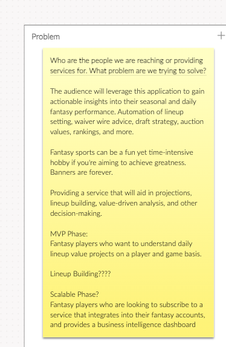
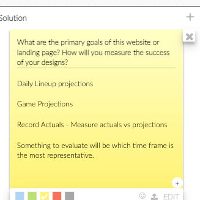
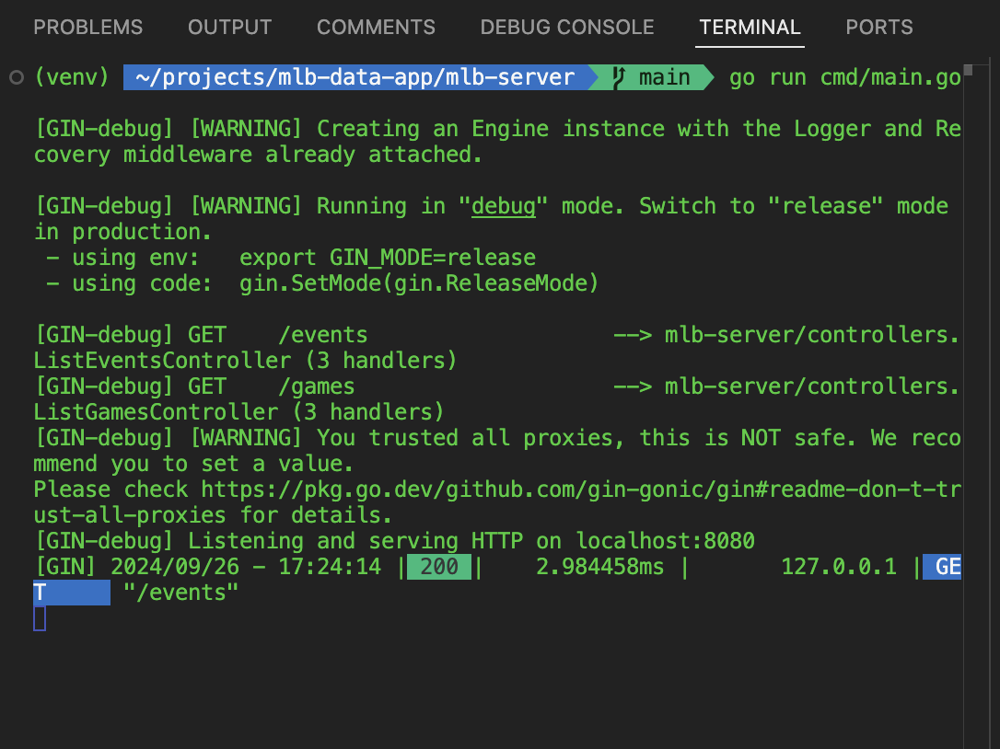
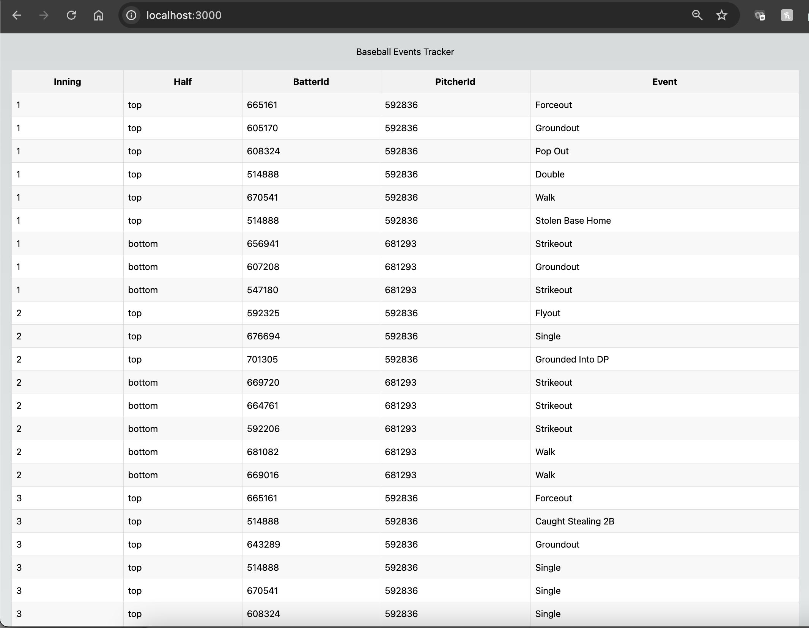
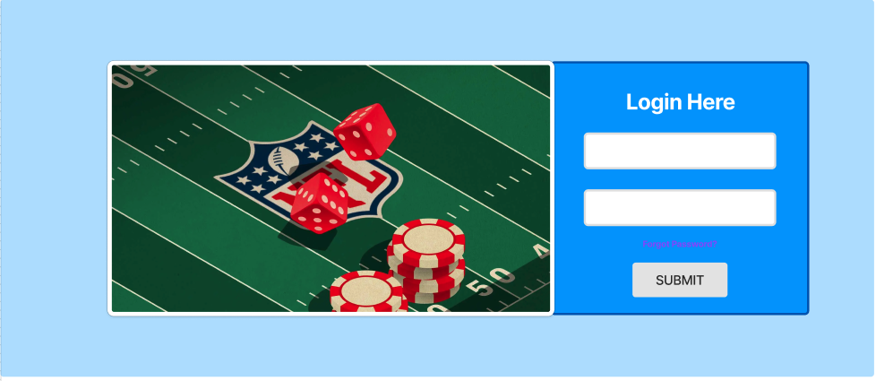
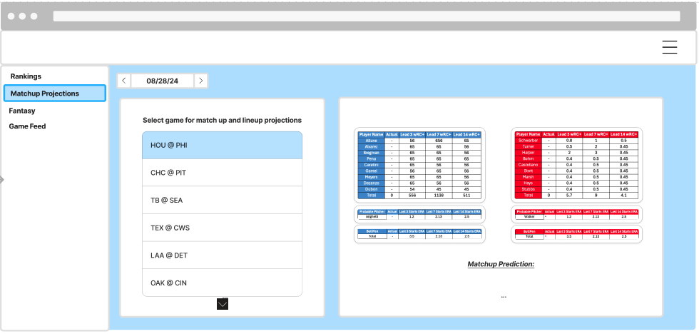

# Project Overview

### Objective:
Predice baseball game outcomes using a combination of lineup performance, pitcher runs allowed, bullpen strength, pitch-by-pitch data, and more.

Lean canvas




### Key Features:
- Pre-game analytics to estimate outcomes before game begins.
- Track top fantasy player performances.
- Analyze games pitch-by-pitch
- Eventually, create robust prediction engine combing all data points.

### Data Sources
1. MLBAM API (Primary Source)
  - provides in-depth play-by-play data, linwups with pitcher stats, and bullpen data.


#### Play By Play
- Ensuring that you're accounting for empty payloads with game statusCode
`pbp_data["gameData"]["status"]["statusCode"]`
- Creating and enum for different status could help here. Depending on status, write payload or return empty payload
```
   "status": {
      "abstractGameState": "Preview",
      "codedGameState": "S",
      "detailedState": "Scheduled",
      "statusCode": "S",
      "startTimeTBD": false,
      "abstr
```

#### Probable Pitchers
- pbp data: indexed -> pbp_data['gameData']['probablePitchers']
- pbp_data['gameData']['probablePitchers']['home']['id']
- pbp_data['gameData']['probablePitchers']['away']['id']
Using logic to check if data exists in here and return None if there is None. I'll overwrite these values when I find something and update records.

Example:
```
{'away': {'id': 681293, 'fullName': 'Spencer Arrighetti', 'link': '/api/v1/people/681293'}, 'home': {'id': 592836, 'fullName': 'Taijuan Walker', 'link': '/api/v1/people/592836'}}
```

#### Lineup data
`pbp_data['liveData']['boxscore']['teams']['home']['battingOrder']`
`pbp_data['livedata']['boxscore']['teams']['away']['battingOrder']`
Depending on game status this may vary since lineup has not been announced.


#### Get bullpen data
`pbp_data['liveData']['boxscore']['teams']['away']['bullpen']`
`pbp_data['liveData']['boxscore']['teams']['home']['bullpen']`

First Pitch
`pbp_data['gamedata']['gameInfo']`
```
{'attendance': 37778, 'firstPitch': '2024-08-28T20:07:00.000Z', 'gameDurationMinutes': 148}
```
2. Fangraphs (Secondary Source)
  - For advanced baseball statistics and player metrics.
3. Spotrac
  - For player contracts, salary-related data to include financials in analysis.


### Data Volume:
- Play by Play Data: 180K+ records per season
- Historical Data: 15-20 seasons ~15-20 GB


### Data Model


#### Primary Tables:
  - raw_pbp: Raw play-by-play data
  - raw_schedule: Games schedule and statuses
  - raw_lineups: Starting lineups and batting orders.

Currently we have the following tables:   
Play by Play, Events, and Runs Created
  - raw_pbp
  - curated_events_runs_created

Schedule and Games
  - raw_schedule
  - curated_games

Lineups
  - raw_lineups
  - curated_lineups

Data Model Expansion:
- Teams
- Players
- Games
- Seasons
- Leagues
- Venues


Notes for identifier column:
Combining three columns
`md5_to_uuid_func.sql` - Has the transformation logic to create a unique id for lineups table by concatenating and hashing the unique id for md5, this then gets converted to a uuid. This test logic could be used for other tables, just need to make sure it works.

Need to ensure that the function made for md5_to_uuid is actually necessary.


#### Curated Tables:
 - curated_pbp: Processed play-by-play data 
 - curated_games: Processed schedule and game data.
 - curated_lineups: Curated lineup data with pre-game data

Initial DDL for palyers
```
-- mlb.players definition

-- Drop table
-- DROP TABLE mlb.players;

CREATE TABLE mlb.players (
	player_id text NULL,
	player_name text NULL,
	player_pos text NULL,
	season text NULL,
	team_id text NULL
);
```

#### Future Gold Tables:
- TODO:
- TODO:

1. Define lineup value schema
- game level granularity
- leading calculations across various timespans
  3 days
  7 days
  14 days 
  1 month
  3 months
  6 months
2. Create query to populate the table
3. Have table for one game created
4. ensure only new records are going through cascading process
5. write way to handle duplicates / on insert overwrite, etc.
6. Create triggers for tables to run when new inserts have (INSERT INTO)

7. Create Model ON API side to get that table and query the data
8. Create React/Client Component to fetch that data
LEAD, LAG function docs - reference
https://datalemur.com/sql-tutorial/sql-time-series-window-function-lead-lag

Snapshotting here? How am II tracking this overtime?

### Data Architecture:
Bronze Layer: Raw data directly from external sources (MLBAM API, Fangraphs, Spotract)

Silver Layer: Curated and processed data (aggregations, filtering, transformations)

Gold Layer: Aggregated and calculated data ready for API consumption and real-time queries.


### System Architecture:
DUCKDB - In Testing 
- Efficient for analytical queries on local files

PostgreSQL
- Production database for relational data tables and structured data models.

Data Processing
- Transformation Pipelines: Run on ingested data to curate raw data into useful analytical formats (pbp -> curated events -> calculations)


### API Development (GoLang):
Server: 

- API Calls
  - Building endpoints to provide data like play-by-play analysis, lineup performance, and game outcomes

- Core Components for Go 
  1. http.Client - API requests
  2. http.Request - handle different requests and responses
  3. context.Context for timeouts and cancellation
  4. Request Payload

Backend Enhancements:
Create more API endpoints for each entity (e.g, /teams /players, /games)
Implement filtering, sorting, and pagination in API
Add auth

### Integration and Contract Testing
Reliability between services is paramount in modern software. If you are building an API that is meant
to define communication betweens services or that are system critical it might be worth expanding
your test stack.
● Integrations Tests
● End-to-End Tests
Additional info here

- Integration Tests with Github Actions
- Sidecar docker container - io style calls
- docker containers
- Scripts/makefile


### Frontend Development (Reac/Next.js) (Client):
UI:

UI Mock Up Design




UI/UX Design:
- Designing the frontend with Next.js with a focus on displaying game statistics, lineup values, and game predictions.
- Components:
  - `EventTable.tsx`: Table for displaying play-by-play data and player stats. Takes ana array of `Event` objecs as a prop.
  - Component renders a able with headers for Inning, Half, Batter, Pitcher, and Event.
  - It maps over the events array to create a row for each event.
  - We're using some basic Tailwind CSS classes for styling

  - `UserInterface.tsx`:
  - This component now uses the `EventTable` component instead of rendering individual `BaseballEvent` components.
  - It passes the `events` array to the `EventTable` component.

  - Sorting, filtering, and paginations are future enhancements.
  - Expanding this into visualizations (charts, graphs, etc.)

  To use new components and other table views in the UI:
  
  1. Save the `EventTable.tsx` in the `components` folder.
  2. Update the `UserInterface.tsx` file as shown above.
  3. Make sure your `pages/index.tsl   file is still correctly fetching and passing events data.

  This simple table view will give a good starting point to learn and expirment with React and TSX.

  How to expand on this:
  1. Add Sorting functionality to table columns
  2. Implement pagination to handle large numbers of events.
  3. Add filters to show events for specific innintgs or players.
  4. Create a detail view that shows when you click on a row.

  In React, we want to create reusable components and managing state. As I build more features, I'll get more comfortable with these concepts.

  Implement charts and graphs using libraries like Chart.js or D3.js
  Create interactive field diagrams for spatial analysis


  Styling Improvements:
  Add more CSS to make table more visually appealing
  Implement responsive design for better mobile viewing.

  Functionality Enhancements:
  - Sorting (sort by inning, batter, or event type -> in a ranking table)
  - Implement filtering
  - Pagination

  Data Visualization:
  - create charts or graphs to represent game statistics
  - add visual representation of baseball field or positions

  User interaction
  - allow users to click on row to see more details, drill down with a search function to find specific events quickly

  - Implement user accounts for personalized dashboards
  - Allow users to create and save custom reports


  Real-time updates:
  - If possible, implement live updates as new events occur during a game

  Game Summary:
  - Add a summary section showing key stats

  Multiple Game support:
  - Allow users to switch between different games or dates


### Data Flow

#### Batch
1. Ingestion Pipelines:
  - Collect Raw Data from APIs (MLBAM, Fangraphs)
  - Validate, clean, and store in bronze tables

2. Curation Pipelines:
  - Tranasform raw data into silver tables with curated data
  - Handle pivoting, aggregation, and filtering

3. Final Gold Tables:
  - Store high-level aggregates ready for API consumption
  - Daily lineup values, game predictions, player metrics

#### Streaming
Real-time updates:
If possible, implement live updates as new events occur during a game


#### Backfilling
BACKFILLING: Orchestration needs to be drawn up.

1. Schedule and GAME backfilling is the first step
2. PBP Backfilling
3. Player and Roster backfilling
4. Analytics backfilling

Version 1 for backfilling pipeliens works but python code needs to be refactored


### Data Quality
Validation Functions are functions that can be run in tandem with pipelines.
Simple but effective functions that ensures valid function runs and data collection/movement

Need to validate that I'm only inserting new records and overwrite on a key so no duplicates. We'll add a data quality check to write's to a personal slack channel to ensure this is monitored. OR OR OR -> SNS topic? Email alerts? over slack? 

### Orchestration and Automation:
- Cron for python jobs to stay lightweight, but eventually a Dockerized Airflow/Dagster could be thought about.

- Stored procedures and triggers for SQL based transformation and triggering.

### Post-MVP Features:
1. Backfills:
  - backfill historical data (PBP, shcedule, players, rosters)

2. Advanced Calculations:
  - lead/lag functions in SQL for histroical trends and player/linup analysis
  - WAR, FIP

3. Real-Time Data (Streaming)
  - IMplement streaming or real-time ingestion for live games (websockets, polling APIs)

4. Testing

5. Analytics Dashboards:
  - Build a frontend dashboard showing pre-game predictions, live updates, and game summaries.
  - Add filters and drill-down functionality for detailed stats and comparisons
  - Team Analysis:
    - Team performance over time
    - Player stas within teams
    - Head-to-head comparison

  - Player Profiles:
    - Individual player stats
    - Performance trends
    - Comparison tools

  - Game Analysis
    - detailed game breakdowns
    - play-by-play analysis
    - win probability charts

  - League Analysis
    - Team Stat League standings
    - Player Stat League standings
    - Playoff predictions

  - Advanced Analytics:
    - Predictive models for player performance
    - Team strategy analysis
    - Player value calculations (e.g., WAR)


6. Cloud Hosting & CICD:
  - Implement CI/CD piplines for GoLang API.
  - containerize the GO API and deploy

7. Security:
  - Add authentication and auth to protect API endpoints (OAuth)


# Current State TODO's and Action Items:
### Immediate Next Steps:
1. Complete Ibgestion Pipelines
2. Curate Processed Silver Tables
3. Design Gold Table Models
4. Develop API endpoints
5. Build UI components for data


#TODO: 
- finalize SQL queries that are in dbeaver and in vscode ( 15 mins )
- need to standardize ingestion functions
- standardize_column_names
- standardize main gunctions
- abstraction and function refactoring to minimize code
- OOP? -> can design
- INSERTS ON CONFLICT standardized
- level up logging from print    

#Distributing Project
Makefile
Bash Scripts for local deployment
run one command


## DUCKDB testing
persistent storage
```
conn = duckdb.connect("file.db")
duckdb.sql("LOAD pg_duckdb;")
duckdb.sql("SELECT 4;")
duckdb.sql("CREATE EXTENSION pg_duckdb;")
```


