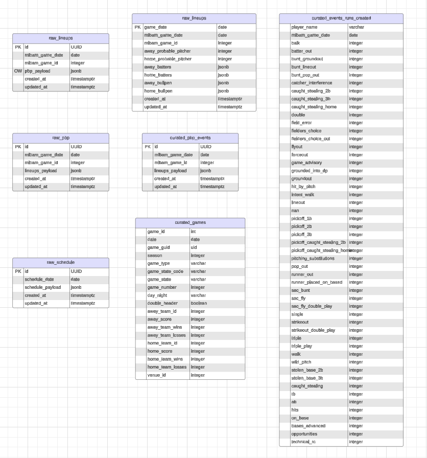

Thinking about object oriented approach
base classes that set up database connections and set context for mlb class
Those base classes at LLI used ORM but honestly this is not lightweight and I don't think
I need to go down this route


# DUCKDB testing
persistent storage
```
conn = duckdb.connect("file.db")
duckdb.sql("LOAD pg_duckdb;")
duckdb.sql("SELECT 4;")
duckdb.sql("CREATE EXTENSION pg_duckdb;")
```

# Data Sources and Endpoints

### Get Play by Play
- need to figure out how I'm going to account for empty payloads with game statusCode
`pbp_data["gameData"]["status"]["statusCode"]`
- I can create an enum and get the different status. Depending on status, write payload or return empty
  payload
```
   "status": {
      "abstractGameState": "Preview",
      "codedGameState": "S",
      "detailedState": "Scheduled",
      "statusCode": "S",
      "startTimeTBD": false,
      "abstractGameCode": "P"
```

### Probables pitchers
- pbp data: indexed -> pbp_data['gameData']['probablePitchers']
- pbp_data['gameData']['probablePitchers']['home']['id']
- pbp_data['gameData']['probablePitchers']['away']['id']
I've inserted logic here to check if there is data in here and to retun None if there is None. I'll overwrite these values when I find something and update records

{'away': {'id': 681293, 'fullName': 'Spencer Arrighetti', 'link': '/api/v1/people/681293'}, 'home': {'id': 592836, 'fullName': 'Taijuan Walker', 'link': '/api/v1/people/592836'}}

### Get Line up data
- pbp_data['liveData']['boxscore']['teams']['home']['battingOrder']
- pbp_data['liveData']['boxscore']['teams']['away']['battingOrder']
This could be empty depending on the game status and lineup hasnt been announced. SO I guess we write
empty value to database and then update.

### Get bullben data
- pbp_data['liveData']['boxscore']['teams']['away']['bullpen']

First pitch
- pbp_data['gameData']['gameInfo']
{'attendance': 37778, 'firstPitch': '2024-08-28T20:07:00.000Z', 'gameDurationMinutes': 148}

Combining three columns
`md5_to_uuid_func.sql` - Has the transformation logic to create a unique id for lineups table by concatenating and hashing the unique id for md5, this then gets converted to a uuid. This test logic could be used for other tables, just need to make sure it works.

Need to ensure that the function made for md5_to_uuid is actually necessary.

### validation functions
Validation Functions are functions that can be run in tandem with pipelines.
Simple but effective functions that ensures valid function runs and data collection/movement

## Update Sept 10. 2024
Tables for raw_schedule, raw_pbp, and raw_game lineups have mock data.
The next step is to curate these records into silver tables
- curated_schedule
- curated_pbp
- curated_lineups (if necessary - this might just be transformed in the process)

We curate that data and then we move towards create the calculated gold_ tables for the API to consume.

Then we start building the API and react client.


After MVP
- write tests
- backfills
- streaming
- CICD
- Cloud Hosting
- Security?

## Update Sept 11. 2024
We need to transform the pbp data into the runs created stuff I've done in python.
BUT do I do it in python? If yes, how do I orchestrate that? I can't trigger python via postgresql.
Can I find a way to pivot in PostgreSQL? If I do choose python, what tool orchestrates and runs the
Python? It was cronjob to initially run the other python scripts. Maybe I do that for the Run calculated stuff too? 
Query DB table and write back to new table?

Right now we have the events matched up with the baseball reference for the sample data and steals. Define the columns and we're good.


### GoLang Portion: API and Client (Javascript)

Making API Calls

4 necessary things to build a Go Client
- http.Client
- http.Request
- context.Context -> times or cancel functions
- Request payload


Building a client that connects to your server

server in one terminal tab
client running in another terminal tab


### Integration and Contract Testing
Reliability between services is paramount in modern software. If you are building an API that is meant
to define communication betweens services or that are system critical it might be worth expanding
your test stack.
● Integrations Tests
● End-to-End Tests
Additional info here


- integration tests with github actions
- Sidecar docker containers - io style calls
- Mock database to mock integration
- docker container
- script to make call and 

- Deploy Go Server

TODO:
- DAte in events is WRONG


### UI - NextJS 
Certainly! I'd be happy to help you create a simple table to display this data. This will be a great starting point for learning React and TypeScript. Let's create a new component for this table view.

First, let's create a new file called `EventTable.tsx` in your `components` folder. Here's a simple implementation of a table component:


Here's a breakdown of what's happening in these components:

1. `EventTable.tsx`:
   - This component takes an array of `Event` objects as a prop.
   - It renders a table with headers for Inning, Half, Batter, Pitcher, and Event.
   - It maps over the events array to create a row for each event.
   - We're using some basic Tailwind CSS classes for styling.

2. `UserInterface.tsx`:
   - This component now uses the `EventTable` component instead of rendering individual `BaseballEvent` components.
   - It passes the `events` array to the `EventTable` component.

__USER INTERFACE__ - #TODO -> Design front end __( Figma )__

To use this new table view:

1. Save the `EventTable.tsx` file in your `components` folder.
2. Update the `UserInterface.tsx` file as shown above.
3. Make sure your `pages/index.tsx` file is still correctly fetching and passing the events data.

This simple table view will give you a good starting point to learn and experiment with React and TypeScript. Here are some ideas for how you can expand on this:

1. Add sorting functionality to the table columns.
2. Implement pagination to handle large numbers of events.
3. Add filters to show events for specific innings or players.
4. Create a detail view that shows when you click on a row.

Remember, React is all about creating reusable components and managing state. As you build more features, you'll get more comfortable with these concepts. Don't hesitate to ask if you have any questions or if you'd like to learn how to implement any specific features!

Styling improvements:

Add more CSS to make the table more visually appealing
Implement responsive design for better mobile viewing

Functionality enhancements:

Add sorting capabilities (e.g., sort by inning, batter, or event type)
Implement filtering (e.g., show only events for a specific inning or player)
Add pagination if there are many events

Data visualization:

Create charts or graphs to represent game statistics
Add a visual representation of the baseball field and player positions

User interaction: 

Allow users to click on a row to see more details about the event
Implement a search function to find specific events quickly

Real-time updates:

If possible, implement live updates as new events occur during a game

Game summary:

Add a summary section showing key statistics for the game

Multiple game support:

Allow users to switch between different games or dates

Would you like to focus on any of these areas? Or do you have any specific features in mind that you'd like to implement next? I'd be happy to guide you through the process of adding new functionality to your application.

To transform this into a comprehensive baseball business intelligence app, consider the following enhancements:

Data Model Expansion:

Teams
Players
Games
Seasons
Leagues
Venues


Backend Enhancements:

Create more API endpoints for each entity (e.g., /teams, /players, /games)
Implement filtering, sorting, and pagination in the API
Add authentication and authorization


Frontend Features:
a. Dashboard:

Overview of key statistics
Recent game results
Upcoming games

b. Team Analysis:

Team performance over time
Player statistics within teams
Head-to-head comparisons

c. Player Profiles:

Individual player statistics
Performance trends
Comparison tools

d. Game Analysis:

Detailed game breakdowns
Play-by-play analysis
Win probability charts

e. League Standings:

Current standings
Playoff predictions

f. Advanced Analytics:

Predictive models for player performance
Team strategy analysis
Player value calculations (e.g., WAR)


Data Visualization:

Implement charts and graphs using libraries like Chart.js or D3.js
Create interactive field diagrams for spatial analysis


User Interaction:

Implement user accounts for personalized dashboards
Allow users to create and save custom reports


Real-time Updates:

Implement WebSocket connections for live game updates


To start building these features:

Expand your Go backend:

Create new models and database tables for each entity
Implement new API endpoints with filtering and sorting capabilities


Enhance the frontend:

Create new React components for each feature (e.g., Dashboard, TeamAnalysis)
Implement routing to navigate between different views
Use a state management solution like Redux or React Context for complex state


Implement data fetching:

Create custom hooks for fetching data from your new API endpoints
Implement error handling and loading states


Add interactivity:

Implement sorting and filtering on the client-side
Create forms for user input (e.g., date ranges for reports)


Improve the UI:

Use a UI framework like Material-UI or Tailwind CSS for consistent styling
Create a responsive layout for mobile and desktop views


Here's a simple example of how you might start creating a dashboard component:


## update - 9.21.2024
Took a few days break to move and getting back to it. 
1. Checkpoint where I'm at in regards to MVP
2. Inventorize components built and left
3. Check off things
4. refine incomplete things
5. design and iterate UI
6. Finish MVP

1. Checkpoint

Data Model:
- Currently we have the following tables: 
  
Play by Play, Events, and Runs Created
  - raw_pbp
  - curated_events_runs_created

Schedule and Games
  - raw_schedule
  - curated_games

Lineups
  - raw_lineups
  - curated_lineups


Daily Lineup Value Calculations (per team id, away/home per game)
  - total_batting order value (SUM):
  - total pitching value = starting pitcher value + bullpen (SUM):


Data Flow
  - (bronze) raw_pbp -> (silver) curated_pbp -> (silver) curated_events_run_pbp   -------->
  - (bronze) raw_schedule -> (silver) games                                       ------> daily_lineup_values
  - (bronze) raw_lineups -> (silver) curated_lineups                              -------->


- Action item -> Define table model so this can be done (Priority: High)


## update - 9.26.2024


-- daily calculation -> pre-game calculation of leading runs created. 
-- daily calculations to get previous day's actuals and use that to calculate the predicted value going forward
-- snapshotting leading metrics and updating where possible. 
-- do I keep a snapshot date or update based on game date
-- FOR tomorrow's given lineup, I need to 
  

TODO: I need to create the table that is going to have the lineup value information

1. Define lineup value schema
- game level granularity I think
- leading calculations across various timespans
  3 days
  7 days
  14 days 
  1 month
  3 months
  6 months

2. Create query to populate the table
3. Have table for one game created
4. ensure only new records are going through cascading process
5. write way to handle duplicates / on insert overwrite, etc.
6. Create triggers for tables to run when new inserts have (INSERT INTO)

7. Create Model ON API side to get that table and query the data
8. Create React/Client Component to fetch that data


- Tables are defined. Just make a visual representation and then model what the final daily lineup value tables will look like.
- will have a leading calculation in here somewhere. Need to decide if that's being done at the player level or the lineup level.
-

Ingestion pipelines:
- working ingestion pipelines for one game.
- After MVP is done, backfilling db. -> Should I do minio? DB might be too much for historic
- Minio as local file store. DuckDB, as postgresql extension to read minio? We're storing  raw JSON so... we'll see. A decision needs to be made here.

- I need to decide how I'm going to orchestrate this

- Action Item -> 

Curation Pipelines:
- Transformation logic in postgresql is done. Would need to create a stored procedure and trigger on the tables that are involved here. Trigger after insert on new records? Need to validate that I'm only inserting new records and overwrite on a key so no duplicates. We'll add a data quality check to write's to a personal slack channel to ensure this is monitored. OR OR OR -> SNS topic? Email alerts? over slack? idk

- I just added the pivot procedure to the postgresql code. That needs to be a trigger.

- Action Item -> have simple stored function to do operation.

TODO: Design the flow of transformation and curation. How often is it going to happen. How much data is going to be process on each cascading run. This is important


CHECKPOINT UI and SERVER:

UI:
Server: 


Working on:
introducing figma
project and UI design
data model improvements
historical backfill

Lean canvas


UI Mock Up Design


DDL for players?

```
-- mlb.players definition

-- Drop table

-- DROP TABLE mlb.players;

CREATE TABLE mlb.players (
	player_id text NULL,
	player_name text NULL,
	player_pos text NULL,
	season text NULL,
	team_id text NULL
);
```

